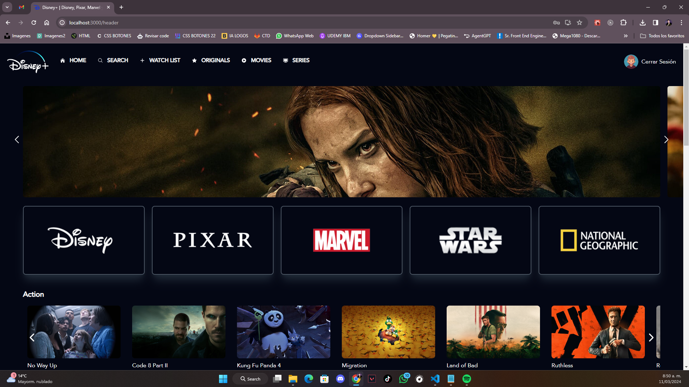

FrontEnd Developer Test - Inspired On Disney+ App
Este es una prueba tenica de react inspirada en la app de disney+, el proyecto consiste en un aplicativo web que permite visualizar contenido multimedia tipo video a usuarios con 
cuenta activa, el proyecto se constituye de la siguiente manera : 

-Home : Esta es nuestra pagina principal, alli se puede visualizar contenido como planes, lo que se ofrece y preguntas frecuentes, el unico boton interactivo sera el del login que esta en la esquina superior derecha.

-Login : Esta pantalla cuenta con campos de correo, contraseña y un boton de ingresar, este es un login para poder ingresar a nuestra app, los usuarios que estan permitidos para ingresar son : 
    -correo: prueba@gmail.com
      clave: 123456
    -correo: usuarioPrueba@gmail.com
      clave: 12345
son los unicos usuarios permitidos, de lo contrario no se podra ingresar al aplicativo.

-Header(pagina principal) : Esta es nuestra pagina principal, alli encontraremos una serie de peliculas, sliders, categorias, navbar, iconos, etc, lo interactivo de esta pantalla es : 
-Slider
-Categorias(con su animacion)
-Peliculas y sus sliders
-Navbar
-Boton cerrar sesion
-Peliculas( boton de trailer despliega un popup con el trailer correspondiente)

-Peliculas : Estas pantallas mostraran la informacion de la pelicua, su banner, su año, su genero, sus actores y una descripcion, como lo dije anteriomente en el boton de trailer lo pueden clickear y este les mostrara el video

Comenzando 🚀
El proyecto uso varias dependencias tales como : 
-Npm
-React dom router
-Styled-components
-Antdesing
-Antdesing-icons
-Axios
-Redux
-Slick-carrousel
-Redux toolkit
-Tailwind css
-Tailwind no scrollbar

El proceso para desplegarlo en local es sencillo, simplemente es copiar el repo o bajar el zip, realizar un "npm install" y un install a las dependencias mencionadas anteriormente, en cualquier caso me pueden preguntar y sin embargo yo dejare el proyecto desplegado para que puedan verlo en funcion, el proyecto es responsive en mas de la mitad, tuve algun inconveniente por lo cual no es completo pero se ajustara en la proxima version.

Construido con 🛠️
El proyecto fue construido con : 
-React JS
-Javascript
-Tailwind
-Html
-CSS
-Ux/ui

Licencia 📄
Este proyecto está bajo la Licencia (DavidPaez592).

Agradezco mucho su amable tiempo, en tomarse la molestia de verlo y darme un feedback al respecto, lo recibire con mucho cariño y como una critica constructiva🎁

⌨️ con ❤️ por David Paez 😊